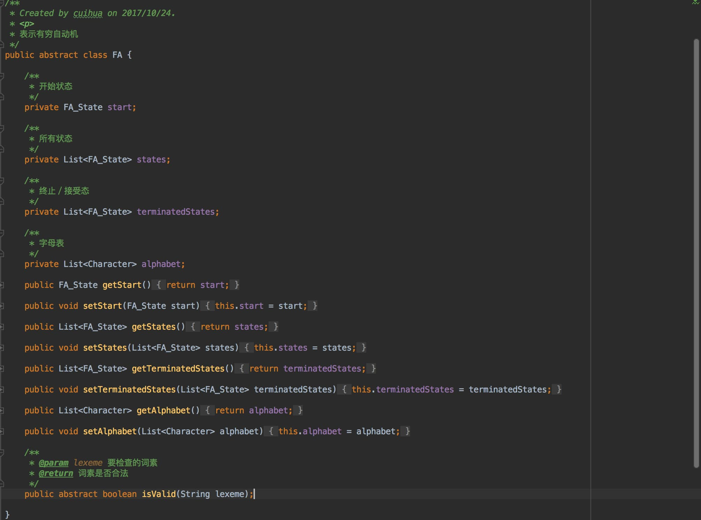
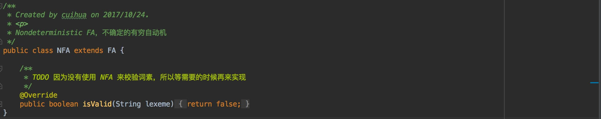
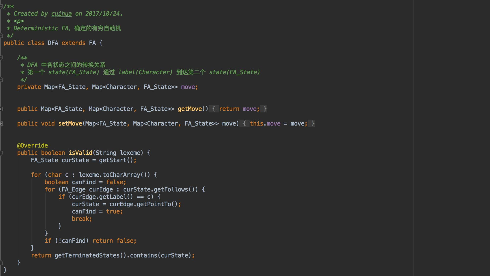
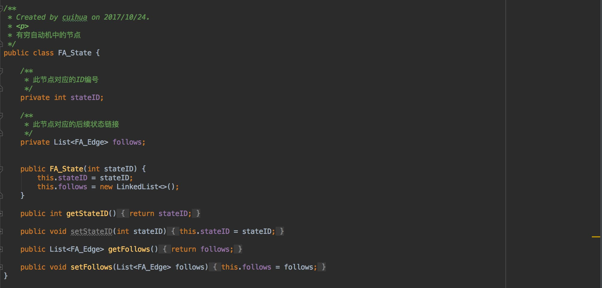
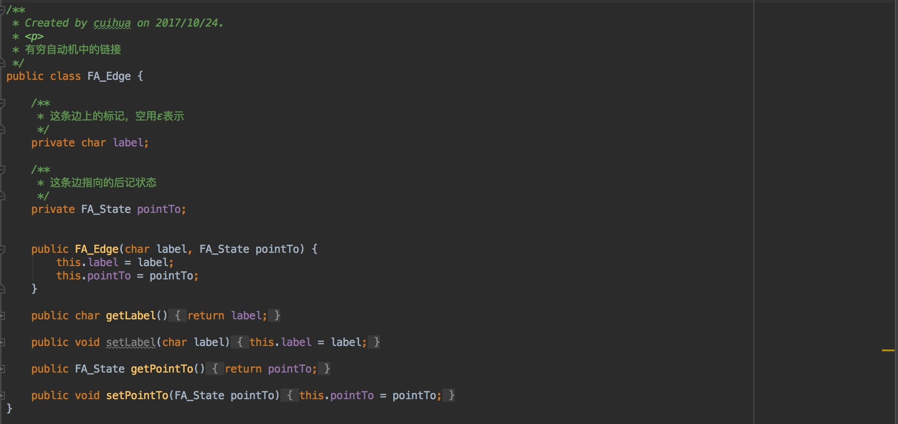
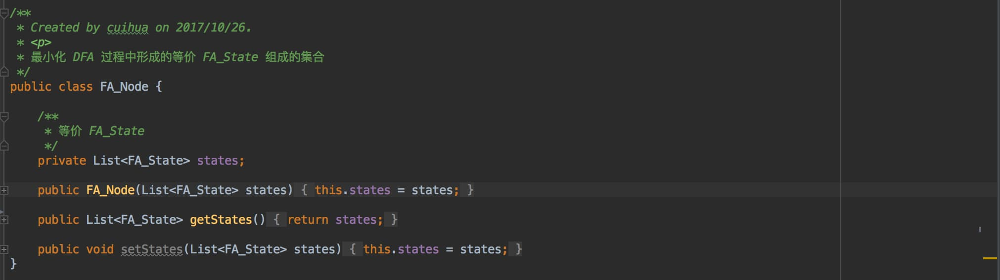
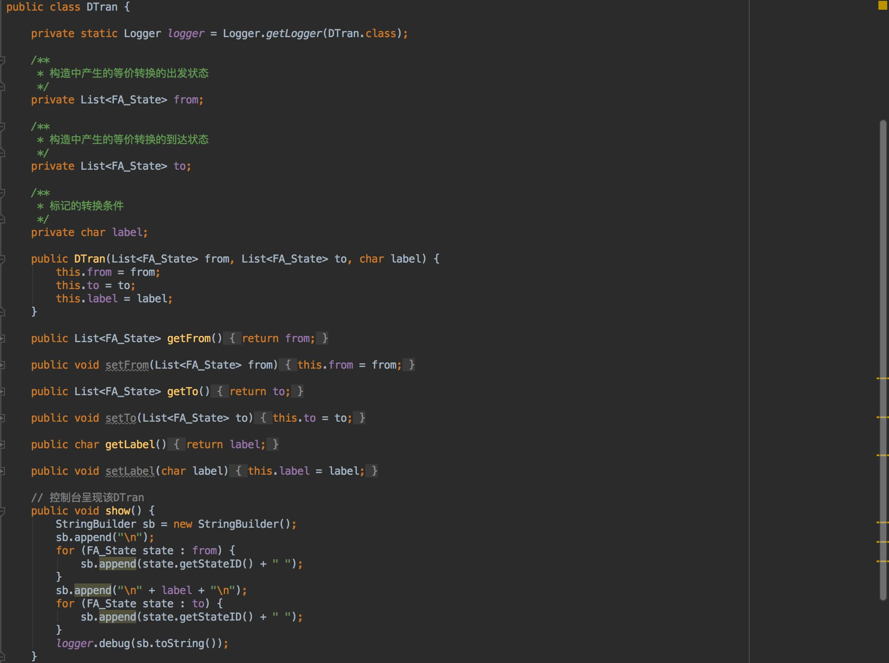
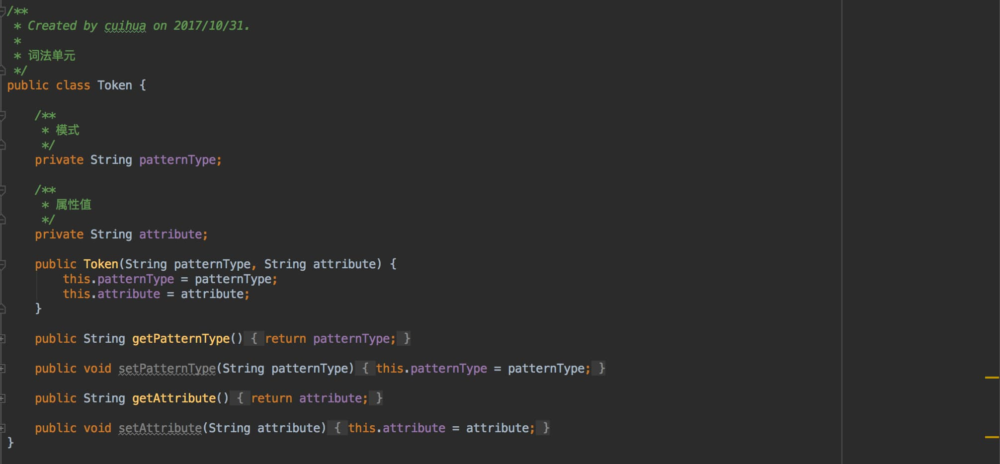

# 📙 Lex 词法分析器

## Motivation / Aim
深入理解编译原理中词法分析的过程，通过实现 RE => NFA => DFA => minimized DFA 的算法过程，生成 Lex 中由 .l 文件生成的 DFA 转换表，再对输入的源程序／文本进行词法分析，最终输出相应的词法单元序列。自动化构建 Lex，深入理解各步转换的核心算法。

## Content description
在整个程序中，我是先从控制台获取用户输入，然后读取资源目录下定义正则定义的 .l 文件，依据 .l 文件中正则定义的顺序为优先级，生成对应的最小 DFA 序列。然后对输入的词素序列依次匹配。

## Ideas / Methods
通过定义自己的 .l lex 文件，生成一个可以用于判断词素是否合法的 DFA，基于 Lex 编程。

## Assumptions
1. 输入的需要分析的源程序／文本中__不含有空格__（引号中也不能出现空格）。
2. 输入文本中支持的正则操作符有且只有 ___· | * + ? () {} [] , -___，如果需要匹配如上所述任一符号，需要在正则定义中对其进行转义。
  + 基本符号 __·__ （连接符） 可以输入，也可以不输入
  + __+__ 表示一次或多次，__?__ 表示0次或1次。
  + __{}__ 支持{n}、{m, n}、{m,}、{,n}四种形式，分别表示出现n次、出现m-n次、出现至少m次，出现至多n次。
  + __[]__ 支持[abc]简写或运算，也支持[a-zA-Z0-9]逻辑顺序连字符形式。
  + 转义使用 __\\__ 进行转义。比如需要匹配左大括号 { ，即需要在 RE 中写入 \\{
3. 输入结束后需要在空白符后输入 __###__ 结束输入，从而让程序运行。
4. 输出的词法单元序列即会出现在控制台，也会出现在代码项目父目录下（与项目 Lex 同级）。


## Related FA description
通过自定义资源目录下 regular_expression.l 中的正则定义，即可获取到对应的 DFA，故没有一定的确切的 FA 描述。


##	Description of important Data Structures
（Java 定义文件位于 /finiteAutomata/entity 和 /lex/entity 下）

1. FA：有限自动机。NFA 和 DFA 的抽象父类，包含字母表、开始状态、结束状态、所有状态，和一个判断输入词素是否合法的抽象方法。

  

2. NFA：不确定的有限自动机。
  

3. DFA：确定的有限自动机。
  

4. FA_State：FA 中的一个节点。包含编号和对后续状态的链接集合。
  

5. FA_Edge：FA 中的一条边／链接。包含边上的标记、这条链接的后继状态。
  

6. FA_Node：最小化 DFA 的时候，用于划分等价的 DFA 等价集合。
  

7. D_Tran：子集构造法中，包含对处理的 NFA 进行转换关系的映射。包含等价状态的开始态、等价状态的结束态、等价状态的标记。
  

8. Token：词法分析后得到的的词法单元。包含此法单元的名称和属性值。
  

## Description of core Algorithms

（Java 定义文件位于 /finiteAutomata 下）

### 1. RE => standardized RE postfix
首先将扩展符号 +、?、{}、[] 用基本符号 · | * 代替，如 a+ 可以替换为 aa*，a? 可以替换为 (ε|a)，并为正则定义补上缺省的连接符；然后将只含有并、或、闭包，括号的中缀表达式转换为后缀表达式。在这一步骤中，如果处理的字符是一个转义字符，则将其当作一个普通字符处理，具体实现中则是使用一个布尔变量 curCharIsTransferred 在遍历输入时标记前一字符是否为转移符号 __\\__ （即当前字符是否为需要被转移的操作符号）。

### 2. RE => NFA
输入标准化的正则定义后缀表达式，对其遍历，一个字符一个字符处理即可。若不为操作符，即操作数或转移的操作符，即新增这样一个只有两个状态，链接边为此字符的 NFA，若为操作符号则使用栈的形式暂时保存构建过程中产生的各 NFA，如遇见连接符（·）就取栈顶两个 NFA 连接，遇见或符（|）就取栈顶两个 NFA 做或操作，遇见闭包符（*）就取栈顶 NFA 闭包。

### 3. NFA => DFA
对处理过的正则定义后缀表达式通过 *子集构造法* 构建等价的 DFA。

### 4. DFA => minimized DFA
因为 DFA 中等价的状态节点意义相同，可以合并，所以可以通过算法构建状态数目最少的 DFA。具体思想是：先将其划分为终止态集合和非终止态集合，再分别计算每一个节点状态在字母表上每一个标记的后继状态是否等价。而在实现中，用布尔变量 isWeakEqual 标记整个算法是否产生了新的等价状态，保证算法退出时有实现 look back 回头看，即后续的状态集合分化可能会引起之前已经分化的状态集合再次分化。

## Use cases on running
在满足 Assumptions 的前提下，可以任意修改资源文件目录下 regular_expression.l Lex文件，并在控制台输入与之对应的源程序／文本，与 Lex 文件匹配。

比如对实践中现有的 regular_expression.l 可输入：
```
, ; >= != =
2 5 14 47
2345676543
a 
t E surprise
"Wordmakesman" curTemperature10
{aaaaaaabbbbbbbbcc} [0-9]aaa
###
```

另外，在 /test 目录下，也存在很多测试用例可供测试。

## Problems occurred and related solutions

1.  最开始我是将所有正则定义依次构建为 NFA，再将各 NFA 连接为一整个大的 NFA，再将此 NFA 转换为具有最少状态的 DFA。这样的话，虽然连接为一整个大的 NFA 时只合并了起始态，没有合并终止态，但是因为先合并再形成 DFA，所以在 NFA => DFA 的子集构造法中取 ε 闭包时，也变相合并了终止态。所以最终形成的 DFA 中一个终止态会对应多个正则定义的模式，那至于他具体对应的是哪一个模式 pattern 就需要进一步处理。最开始采用将这多个可能的正则定义再生成一次最小 DFA，即使使用了 map 映射尽可能减少生成的次数，但是至少也会多算一次。所以在想通出现一个终止态对应多个正则定义／模式后，决定不再将所有正则定义生成的所有 NFA 连接为一个 NFA，而是分别生成 DFA，再依据输入的正则定义为优先级，串形匹配各 DFA，如果合法即可以返回。

2.  DFA 的最小化优化算法虽然很好理解，但是在实践过程中却一直不能合适地写出来，最后通过拆分、减小复杂度的办法，逐步实现了优化算法。


## Your feelings and comments
1. 有时候虽然理解了算法能够手动计算，但是实际用程序语言去实现仍然是一件有难度的事情。
2. 灵活使用各数据结构，能够在一定程度上避免后续的编程错误。

## Highlights
1. 完整、合适的注释，详略得当，便于再次理解与修改，对算法中也别需要注意的点着重注释。
2. 对输入进行词法分析的源程序／文本进行异常处理。如输入 (*a) 形式时会抛出异常 UnexpectedRegularExprRuleException，对输入的形式无法匹配 .l 文件中的正则定义时抛出异常 NotMatchingException。
3. 测试驱动编程。先根据情况写好测试用例，保证够狠地去进行测试。并通过测试各公开接口和使用反射测试私有方法，尽可能全面地覆盖各种情况。
4. 实现了正则定义中的转义符号，从而匹配实践中的操作符。
5. Maven 项目开发，使用 __log4j__ 进行日志记录输出，而不是简单的 System.out.print()。


